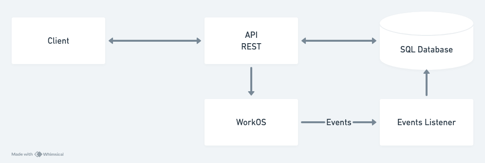

# User Management

*This project was generated using [fastapi_template](https://github.com/s3rius/FastAPI-template).*



Functionality:
1. Paginated users retrieval.
2. User creation.
3. Sync with WorkOS through Events Listener.

Components:
- WorkOS - user management system, single source of truth.
- API - REST API for basic operations on data stored in SQL database. Data could be stale.
- Events Listener - synchronization command between WorkOS and API using [events](https://workos.com/docs/events/data-syncing/events-api).

## How to run

Requirements:
- [docker](https://docs.docker.com/engine/install/)
- [docker-compose](https://docs.docker.com/compose/install/)
- [Makefile](https://www.gnu.org/software/make/)

1. Create [WorkOS](https://dashboard.workos.com/signup) account.
2. Create `.env` file in project folder and copy `WORKOS_CLIENT_ID` and `WORKOS_API_KEY` from [Overview page](https://dashboard.workos.com/get-started).
```
USER_MANAGEMENT_WORKOS_CLIENT_ID=<your-client-id>
USER_MANAGEMENT_WORKOS_API_KEY=<your-api-key>
```
3. Start project.
```bash
make up
```
4. Get logs for all services: api, db, migrator, listener.
```bash
make logs
```

API docs: http://0.0.0.0:8000/api/docs

---

Run formatter:
```bash
make format
```
Run tests:
```bash
make test
```

---

## Development
### Poetry

This project uses poetry. It's a modern dependency management
tool.

To run the project use this set of commands:

```bash
poetry install
poetry run python -m user_management
```

This will start the server on the configured host.

You can find swagger documentation at `/api/docs`.

You can read more about poetry here: https://python-poetry.org/

### Docker

You can start the project with docker using this command:

```bash
docker-compose -f deploy/docker-compose.yml --project-directory . up --build
```

If you want to develop in docker with autoreload add `-f deploy/docker-compose.dev.yml` to your docker command.
Like this:

```bash
docker-compose -f deploy/docker-compose.yml -f deploy/docker-compose.dev.yml --project-directory . up --build
```

This command exposes the web application on port 8000, mounts current directory and enables autoreload.

But you have to rebuild image every time you modify `poetry.lock` or `pyproject.toml` with this command:

```bash
docker-compose -f deploy/docker-compose.yml --project-directory . build
```

### Project structure

```bash
$ tree "user_management"
user_management
├── conftest.py  # Fixtures for all tests.
├── db  # module contains db configurations
│   ├── dao  # Data Access Objects. Contains different classes to interact with database.
│   └── models  # Package contains different models for ORMs.
├── __main__.py  # Startup script. Starts uvicorn.
├── services  # Package for different external services such as rabbit or redis etc.
├── settings.py  # Main configuration settings for project.
├── static  # Static content.
├── tests  # Tests for project.
└── web  # Package contains web server. Handlers, startup config.
    ├── api  # Package with all handlers.
    │   └── router.py  # Main router.
    ├── application.py  # FastAPI application configuration.
    └── lifetime.py  # Contains actions to perform on startup and shutdown.
```

### Configuration

This application can be configured with environment variables.

You can create `.env` file in the root directory and place all
environment variables here.

All environment variables should start with "USER_MANAGEMENT_" prefix.

For example if you see in your "user_management/settings.py" a variable named like
`random_parameter`, you should provide the "USER_MANAGEMENT_RANDOM_PARAMETER"
variable to configure the value. This behaviour can be changed by overriding `env_prefix` property
in `user_management.settings.Settings.Config`.

An example of .env file:
```bash
USER_MANAGEMENT_RELOAD="True"
USER_MANAGEMENT_PORT="8000"
USER_MANAGEMENT_ENVIRONMENT="dev"
```

You can read more about BaseSettings class here: https://pydantic-docs.helpmanual.io/usage/settings/
### OpenTelemetry

If you want to start your project with OpenTelemetry collector
you can add `-f ./deploy/docker-compose.otlp.yml` to your docker command.

Like this:

```bash
docker-compose -f deploy/docker-compose.yml -f deploy/docker-compose.otlp.yml --project-directory . up
```

This command will start OpenTelemetry collector and jaeger.
After sending a requests you can see traces in jaeger's UI
at http://localhost:16686/.

This docker configuration is not supposed to be used in production.
It's only for demo purpose.

You can read more about OpenTelemetry here: https://opentelemetry.io/

### Pre-commit

To install pre-commit simply run inside the shell:
```bash
pre-commit install
```

pre-commit is very useful to check your code before publishing it.
It's configured using .pre-commit-config.yaml file.

By default it runs:
* black (formats your code);
* mypy (validates types);
* isort (sorts imports in all files);
* flake8 (spots possible bugs);


You can read more about pre-commit here: https://pre-commit.com/

### Migrations

If you want to migrate your database, you should run following commands:
```bash
# To run all migrations until the migration with revision_id.
alembic upgrade "<revision_id>"

# To perform all pending migrations.
alembic upgrade "head"
```

#### Reverting migrations

If you want to revert migrations, you should run:
```bash
# revert all migrations up to: revision_id.
alembic downgrade <revision_id>

# Revert everything.
alembic downgrade base
```

#### Migration generation

To generate migrations you should run:
```bash
# For automatic change detection.
alembic revision --autogenerate

# For empty file generation.
alembic revision
```


### Running tests

If you want to run it in docker, simply run:

```bash
docker-compose -f deploy/docker-compose.yml -f deploy/docker-compose.dev.yml --project-directory . run --build --rm api pytest -vv .
docker-compose -f deploy/docker-compose.yml -f deploy/docker-compose.dev.yml --project-directory . down
```

For running tests on your local machine.
1. you need to start a database.

I prefer doing it with docker:
```
docker run -p "5432:5432" -e "POSTGRES_PASSWORD=user_management" -e "POSTGRES_USER=user_management" -e "POSTGRES_DB=user_management" postgres:13.8-bullseye
```


2. Run the pytest.
```bash
pytest -vv .
```
